<p align="center">
  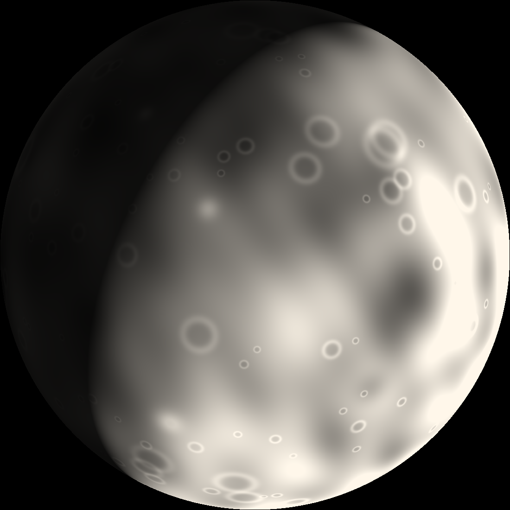
</p>

<h1 align="center">🌗 Terminator Moon</h1>
<h3 align="center">Astronomy, Coordinate Systems &amp; Observation Geometry</h3>
<p align="center"><em>Beginner scientific study guide</em></p>

Prepare new contributors to understand the astronomical geometry behind the Terminator Moon computational-imaging pipeline: **where the observer is, where the Sun is, how the Moon is oriented, and which lunar surface point each image pixel really represents.**

---

## Contents

- [How to use this guide](#how-to-use-this-guide)
- **Part I — The Big Picture**
  - [1. Why do we need astronomy?](#1-why-do-we-need-astronomy-for-terminator-moon)
  - [2. Three "worlds" of coordinates](#2-three-different-worlds-of-coordinates)
- **Part II — Lunar Coordinates**
  - [3. The Moon as a coordinate system](#3-the-moon-as-a-coordinate-system)
  - [4. Degrees vs radians](#4-degrees-are-angles-and-python-wants-radians)
  - [5. Lat/lon are not Cartesian](#5-latitude-and-longitude-are-not-cartesian-coordinates)
  - [6. Spherical ↔ Cartesian](#6-from-spherical-coordinates-to-cartesian-vectors-and-back)
  - [7. Angular distance](#7-angular-distance-on-the-moon)
- **Part III — Vectors, Illumination & Visibility**
  - [8. Sun and Earth directions](#8-sun-direction-and-earth-direction)
  - [9. Surface normals & the dot product](#9-surface-normals-and-the-dot-product)
  - [10. The terminator](#10-the-terminator)
  - [11. Subsolar & sub-Earth points](#11-the-subsolar-point-and-the-sub-earth-point)
  - [12. Phase angle](#12-phase-angle)
  - [13. Visibility + illumination](#13-visibility--illumination-the-four-categories)
- **Part IV — Libration, Orientation & Frames**
  - [14. Libration](#14-libration-the-wobbling-moon)
  - [15. Position angle](#15-position-angle-and-rotation-versus-libration)
  - [16. Reference frames](#16-reference-frames-and-the-moon-fixed-frame)
- **Part V — From the Sky to Pixels**
  - [17. Image coordinates](#17-image-coordinates)
  - [18. Moon disc & normalisation](#18-the-moon-disc-and-normalised-coordinates)
  - [19. Image rotation](#19-image-rotation)
  - [20. Putting it together](#20-putting-it-together-observation-geometry-and-the-three-transformations)
- **Part VI — Real Terrain**
  - [21. The real Moon is not a sphere](#21-the-real-moon-is-not-an-ideal-sphere)
  - [22. The gradient band](#22-why-we-use-a-gradient-band)
  - [23. Science → pipeline](#23-connecting-the-science-to-the-pipeline)
- **Part VII — Advanced**
  - [24. NASA/JPL SPICE](#24-nasajpl-spice)
- **Part VIII — Practice & Reference**
  - [25. Self-check](#25-self-check-what-a-new-contributor-should-be-able-to-explain) · [26. Common mistakes](#26-common-beginner-mistakes) · [27. Exercises](#27-suggested-learning-exercises) · [28. Study order & resources](#28-recommended-study-order-and-resources) · [29. Final mental model](#29-the-final-mental-model)
- **Appendices** — [A Glossary](#a-glossary) · [B Formula cheat sheet](#b-formula-cheat-sheet) · [C Key numbers](#c-key-numbers)

---

## How to use this guide

This guide turns the astronomy behind Terminator Moon into a step-by-step course. It is written for a contributor who knows **basic trigonometry and a little Python/NumPy**, but has never studied astronomy or coordinate transformations. Each chapter is short, builds on the previous ones, and ends up connected to the software pipeline.

**Who this is for**

- Contributors working on geometry, alignment, terminator extraction or fusion code.
- Reviewers who need to check whether a number in the code is a latitude, a vector component or a pixel.
- Anyone who wants to understand why the pipeline normalises, rotates and compares Moon images the way it does.

**How it is organised**

| Part | Question it answers |
|---|---|
| I · The big picture | Why does an imaging project need astronomy? What are the coordinate "worlds"? |
| II · Lunar coordinates | How do we say where something is on the Moon, and convert it to vectors? |
| III · Vectors, illumination & visibility | Where is the terminator? What is the subsolar / sub-Earth point? What can we see? |
| IV · Libration, orientation & frames | Why does the visible face change? How is the image rotated? |
| V · From the sky to pixels | How do lunar positions become pixel positions, and how do we normalise images? |
| VI · Real terrain | Why is the terminator a band rather than a perfect line? |
| VII · Advanced: SPICE | How are the metadata quantities computed by NASA/JPL? |
| VIII · Practice & reference | Self-check, mistakes, exercises, study path, glossary, formulas. |

**Callouts used throughout**

> [!IMPORTANT]
> **Key idea** — the single most important point of a section.

> [!NOTE]
> **Definition / Note** — a precise meaning of a term, or extra context.

> [!WARNING]
> **Watch out** — a common beginner mistake, or a convention that silently breaks results.

> [!TIP]
> **Try it** — a small hands-on exercise. Type it in; don't just read it.

**Colour code in the diagrams:** 🟧 amber = Sun / illumination · 🟦 cyan = Earth / viewing geometry · 🟪 pink = terminator / image pixels · 🟩 green = lunar surface / coordinates.

> [!NOTE]
> The Moon images in this guide are **procedurally rendered** by a small Python script (a sphere shaded from a simple albedo map with approximate mare and crater positions). They illustrate geometry; they do not replace real lunar photographs. For real imagery use the NASA resources in [Chapter 28](#28-recommended-study-order-and-resources).

---

# Part I — The Big Picture

## 1. Why do we need astronomy for Terminator Moon?

Terminator Moon is not simply an image-processing project. The input is an image of the Moon, but that image is the **result of a physical observation geometry**. At a particular time:

- the Moon has a particular **orientation**;
- Earth is located in a particular **direction** relative to the Moon;
- the Sun is located in **another direction**;
- the Moon is illuminated from the Sun's direction;
- only **part of the surface** is visible from Earth;
- the visible part is **projected onto a 2-D image**;
- the boundary between illuminated and dark terrain forms the **terminator**.

> [!IMPORTANT]
> **The guiding question**
> **Where is the observer? Where is the Sun? How is the Moon oriented? Which lunar surface point corresponds to each image pixel?**
> This is the fundamental geometry of the project.

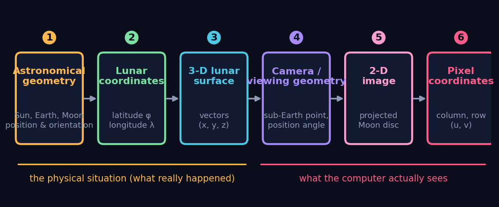

*Figure 1. The computer sees only the last two boxes, but the image was produced by the whole chain. Our job is to understand enough of the chain to move between its stages.*

The same chain as a diagram you can edit:

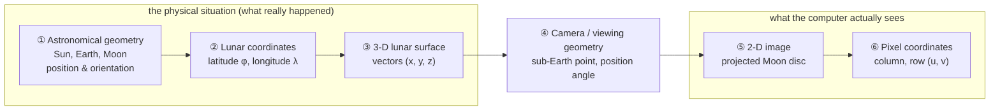
```mermaid
flowchart LR
    A["① Astronomical geometry<br/>Sun, Earth, Moon<br/>position &amp; orientation"] --> B["② Lunar coordinates<br/>latitude φ, longitude λ"]
    B --> C["③ 3-D lunar surface<br/>vectors (x, y, z)"]
    C --> D["④ Camera / viewing geometry<br/>sub-Earth point, position angle"]
    D --> E["⑤ 2-D image<br/>projected Moon disc"]
    E --> F["⑥ Pixel coordinates<br/>column, row (u, v)"]
    subgraph phys["the physical situation (what really happened)"]
    A
    B
    C
    end
    subgraph comp["what the computer actually sees"]
    E
    F
    end
```

### The most important mental model

Imagine the Sun, the Moon and the Earth as three points. Sunlight travels from the Sun to the Moon; light reflected by the Moon travels on to the observer on Earth. Two **directions** as seen from the Moon are enough to describe almost everything: the direction to the Sun **Ŝ** and the direction to Earth **Ê**.

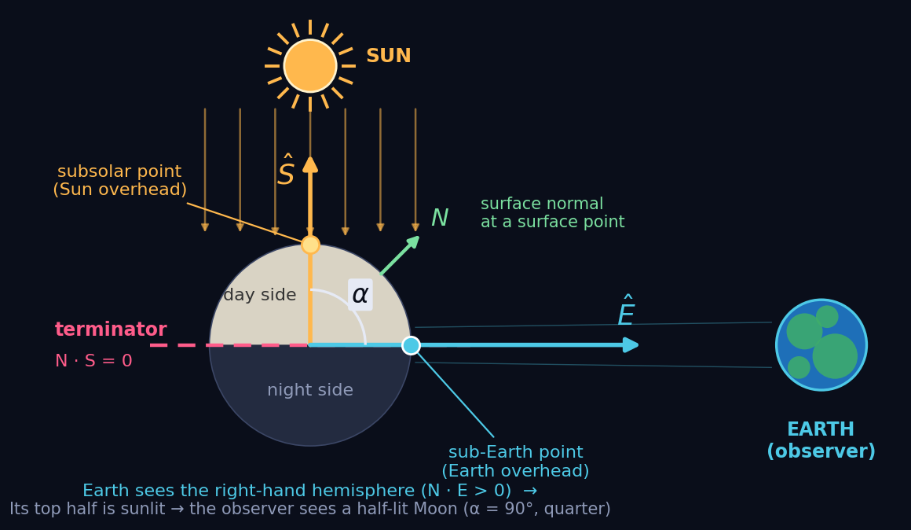

*Figure 2. Sun–Moon–Earth geometry drawn for a quarter Moon (α = 90°). The subsolar point is where the Sun is overhead; the sub-Earth point is where Earth is overhead; the terminator separates day from night.*

The Sun direction decides **where it is lit** (illumination). The Earth direction decides **which half we can see** (visibility). Everything else in this guide is bookkeeping for those two ideas.

> [!NOTE]
> **Definition — Observation**
> `IMAGE` + `METADATA` = `OBSERVATION`. The image alone does not tell you the astronomical geometry; the metadata (time, subsolar position, sub-Earth position, position angle) does.

## 2. Three different "worlds" of coordinates

One of the easiest ways for a new contributor to become confused is to mix different coordinate systems. Terminator Moon involves at least three conceptual coordinate spaces.

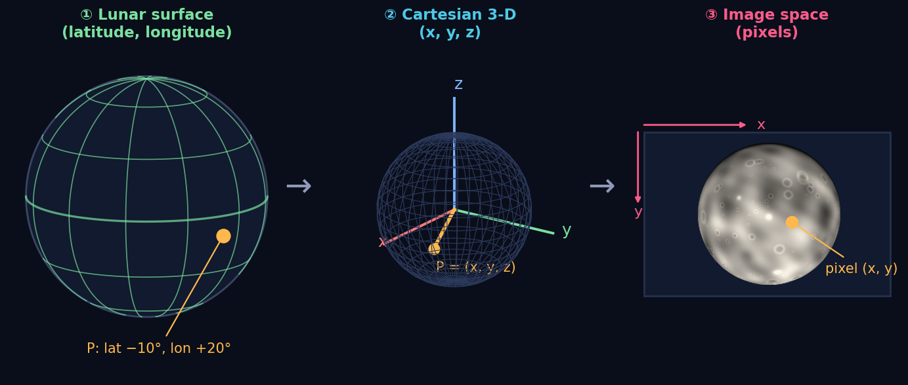

*Figure 3. The same physical point P expressed in three different "worlds". Each arrow is a transformation you will learn in this guide.*

| World | Example | Answers the question | Typical units |
|---|---|---|---|
| ① Lunar surface (selenographic) | latitude = −10°, longitude = +20° | Where is this on the **Moon**? | degrees |
| ② 3-D Cartesian | P = (0.925, 0.337, −0.174) | How do I do **vector geometry** (normals, Sun direction, rotations)? | unit-less (or km) |
| ③ Image (pixels) | (x, y) = (1037, 542) | Where is this in the **picture**? | pixels |

> [!WARNING]
> **A pixel is not a longitude.** A pixel at `(x, y) = (1037, 542)` does **not** mean longitude = 1037° or latitude = 542°. It is simply a location in the image. A major part of our computational problem is understanding the transformation between these spaces.

---

# Part II — Lunar Coordinates

## 3. The Moon as a coordinate system

To describe a location on the Moon, astronomers use a **selenographic coordinate system**. "Selenographic" essentially means *relating to mapping the Moon*. It is analogous to latitude and longitude on Earth.

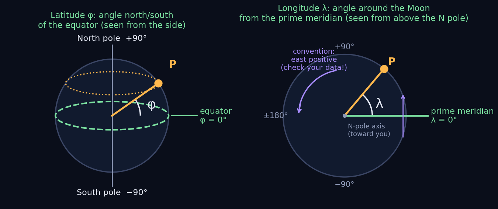

*Figure 4. Latitude (left) measures the angle north or south of the equator; longitude (right) measures the angle around the pole axis from a reference meridian.*

### Latitude

| Latitude | Meaning |
|---|---|
| φ > 0 | northern hemisphere |
| φ = 0 | lunar equator |
| φ < 0 | southern hemisphere |
| +90° / −90° | lunar north / south pole |

For example, φ = +20° is 20° north of the lunar equator; φ = −20° is 20° south.

### Longitude and the prime meridian

Longitude tells us where a point lies east or west around the Moon. It needs a reference: on Earth it is measured from the prime meridian, and the Moon also has a defined reference meridian. Therefore `longitude = 0°` means the lunar prime meridian, and every other longitude is measured relative to it.

> [!WARNING]
> **Never assume a longitude convention.** The exact convention (range 0…360° or −180…+180°, east-positive or west-positive) depends on the reference system and dataset. Always check the documentation. Coordinate conventions are part of the data specification: a mathematically correct transformation with the wrong longitude convention can still produce completely wrong images. *(In this guide's figures, longitude increases toward the lunar east.)*

### Latitude + longitude = a surface location

Together, (latitude, longitude) identify a location on the Moon — the lunar equivalent of an Earth address such as *7.29° N, 80.63° E*. For example, (+12°, −35°) identifies one specific place on the lunar surface.

## 4. Degrees are angles (and Python wants radians)

A complete circle is 360°, a half circle 180°, a quarter 90°, and one degree is π/180 radians.

| Degrees | 0° | 30° | 45° | 60° | 90° | 180° | 360° |
|---|---|---|---|---|---|---|---|
| Radians | 0 | π/6 ≈ 0.5236 | π/4 ≈ 0.7854 | π/3 ≈ 1.0472 | π/2 ≈ 1.5708 | π ≈ 3.1416 | 2π ≈ 6.2832 |

```python
import numpy as np

angle_deg = 30
angle_rad = np.radians(angle_deg)   # 0.5236...
print(np.sin(angle_rad))            # 0.5    (correct: sin 30°)
print(np.sin(30))                   # -0.988 (WRONG: treats 30 as radians!)
```

> [!WARNING]
> **The classic bug.** Almost every math function in Python, NumPy and OpenCV works in **radians**, while metadata and maps quote **degrees**. Convert at the boundary and name variables clearly: `lat_deg`, `lat_rad`.

## 5. Latitude and longitude are not Cartesian coordinates

Suppose latitude = 30° and longitude = 40°. You cannot simply write `x = longitude, y = latitude` and assume that ordinary 2-D geometry gives physical distance on the Moon. The Moon is approximately spherical, and meridians of longitude converge toward the poles.

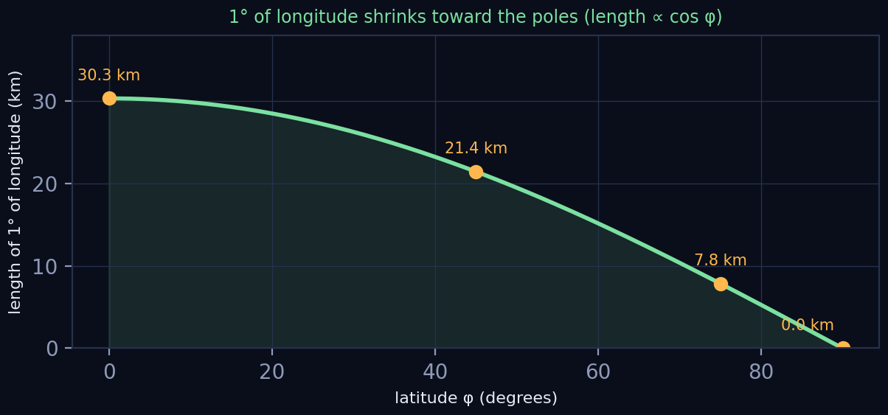

*Figure 5. On a sphere of radius 1737.4 km, one degree of longitude spans about 30.3 km at the equator but shrinks to zero at the poles.*

Near the equator 1° of longitude is a relatively large east–west distance; near a pole it is tiny; at the pole all longitudes meet. **Spherical geometry is needed.**

## 6. From spherical coordinates to Cartesian vectors (and back)

For many calculations it is easier to represent a lunar surface point as a 3-D vector. Assume a spherical Moon of radius *R*, with latitude φ and longitude λ:

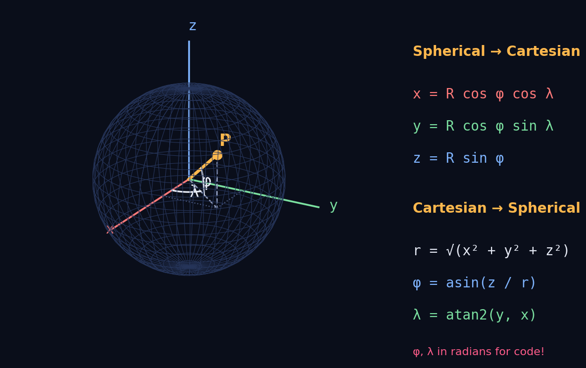

*Figure 6. A surface point P as a vector from the Moon's centre. λ is measured in the equatorial (x–y) plane; φ is measured up from that plane.*

**Spherical → Cartesian**

$$x = R\cos\varphi\cos\lambda \qquad y = R\cos\varphi\sin\lambda \qquad z = R\sin\varphi$$

**Cartesian → Spherical**

$$r=\sqrt{x^2+y^2+z^2} \qquad \varphi=\arcsin(z/r) \qquad \lambda=\operatorname{atan2}(y,x)$$

*(φ, λ in radians for code!)*

> [!WARNING]
> **The axes are a convention.** The formulas above put λ = 0 on the +x axis and the pole on +z. That is a *choice*. Never assume +X = east, +Y = north, +Z = up unless the frame definition says so.

### A worked example

Take φ = 20°, λ = 40°, R = 1:

- x = cos 20° · cos 40° = **0.7198**
- y = cos 20° · sin 40° = **0.6040**
- z = sin 20° = **0.3420**
- Check: x² + y² + z² = 1.0000 (unit length, as it should be on a unit sphere).

```python
import numpy as np

def latlon_to_xyz(lat_deg, lon_deg, radius=1.0):
    lat, lon = np.radians(lat_deg), np.radians(lon_deg)
    x = radius * np.cos(lat) * np.cos(lon)
    y = radius * np.cos(lat) * np.sin(lon)
    z = radius * np.sin(lat)
    return np.array([x, y, z])

def xyz_to_latlon(x, y, z):
    r = np.sqrt(x*x + y*y + z*z)
    lat = np.degrees(np.arcsin(z / r))
    lon = np.degrees(np.arctan2(y, x))          # atan2, not atan!
    return lat, lon

p = latlon_to_xyz(20, 40)
print(p)                      # [0.7198 0.604  0.342 ]
print(xyz_to_latlon(*p))      # (20.0, 40.0) -> round trip works
```

### Why atan2 is important

Beginners often write `longitude = atan(y / x)`. This loses the sign of *x* and *y* separately, so it cannot tell opposite quadrants apart. `atan2(y, x)` keeps the directional information — a small detail that becomes extremely important in coordinate transformations.

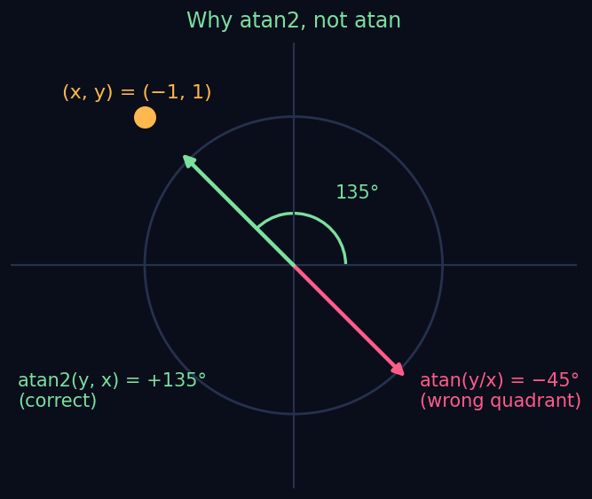

*Figure 7. For the point (−1, 1), `atan(y/x)` returns −45° (pointing to the wrong side of the Moon), whereas `atan2(y, x)` correctly returns +135°.*

## 7. Angular distance on the Moon

Suppose two lunar locations are (φ₁, λ₁) and (φ₂, λ₂). Their separation is **not** `sqrt((lat1-lat2)^2 + (lon1-lon2)^2)`, because the Moon is spherical. One numerically stable formula is the **haversine** relation (φ, λ in radians; *c* is the angular separation in radians):

$$a = \sin^2\!\left(\tfrac{\Delta\varphi}{2}\right) + \cos\varphi_1\cos\varphi_2\,\sin^2\!\left(\tfrac{\Delta\lambda}{2}\right)$$

$$c = 2\,\operatorname{atan2}\!\left(\sqrt{a},\sqrt{1-a}\right) \qquad d = R\,c$$

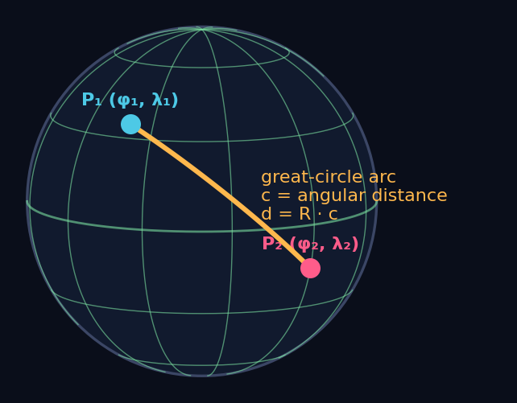

*Figure 8. The shortest path between two surface points is an arc of a great circle; c is the angle that arc subtends at the Moon's centre.*

```python
import numpy as np

def haversine(lat1, lon1, lat2, lon2, R=1737.4):   # R in km (mean lunar radius)
    p1, p2 = np.radians(lat1), np.radians(lat2)
    dphi, dlam = p2 - p1, np.radians(lon2 - lon1)
    a = np.sin(dphi/2)**2 + np.cos(p1)*np.cos(p2)*np.sin(dlam/2)**2
    c = 2 * np.arctan2(np.sqrt(a), np.sqrt(1 - a))
    return np.degrees(c), R * c

print(haversine(0, 0, 0, 90))   # (90.0, 2729.1)  a quarter of the equator ≈ 2729 km
```

> [!IMPORTANT]
> **Equivalent vector view.** With unit vectors `u`, `v` for the two points, the angular separation is simply `arccos(u · v)`. The haversine form is preferred when the two points are very close together.

---

# Part III — Vectors, Illumination & Visibility

## 8. Sun direction and Earth direction

For illumination calculations we think of the Sun as providing a direction vector **S** = (Sx, Sy, Sz) as seen from the Moon. Normalise it so its length is 1:

$$\hat S = S/|S| \quad(|\hat S|=1) \qquad \hat E = E/|E| \quad(\text{direction from the Moon toward Earth})$$

A normalised vector is easier to use in angular calculations: the dot product of two unit vectors is directly the cosine of the angle between them. **Ŝ and Ê are the two fundamental vectors of any observation.**

```python
import numpy as np

def unit(v):
    v = np.asarray(v, dtype=float)
    return v / np.linalg.norm(v)

S_hat = unit([1.0, 0.2, 0.05])   # any vector toward the Sun (frame must be known!)
print(np.linalg.norm(S_hat))     # 1.0
```

> [!WARNING]
> **Both vectors must live in the same frame.** Ŝ and Ê only make sense together if both are expressed in the same coordinate frame (for example the Moon-fixed frame). Mixing frames is the vector-world equivalent of mixing degrees and radians.

## 9. Surface normals and the dot product

Imagine a perfectly smooth spherical Moon. At every point on the surface there is an imaginary arrow perpendicular to the surface: the **surface normal N**. For a perfect sphere it points away from the Moon's centre; in the notation of [Chapter 6](#6-from-spherical-coordinates-to-cartesian-vectors-and-back), the normal at a lunar point *is* its unit vector.

> [!NOTE]
> **Definition — Surface normal.** A unit vector perpendicular to the local surface, pointing outward.

The angle θ between **N** and the Sun direction **S** comes from the dot product:

$$N\cdot S = |N||S|\cos\theta \quad\Longrightarrow\quad N\cdot S=\cos\theta \ \text{(unit vectors)}$$

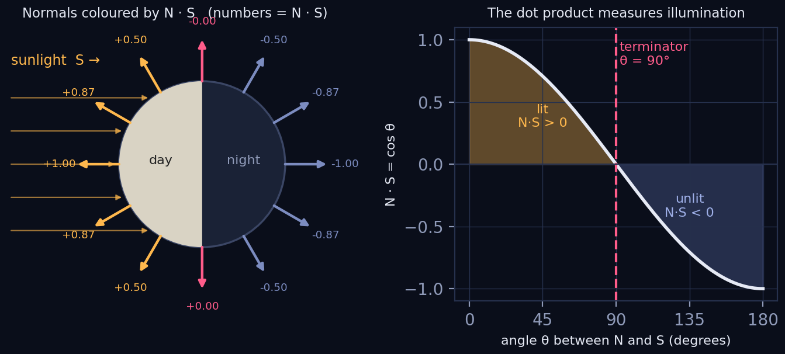

*Figure 9. Left: normals around the limb of a Moon lit from the left, labelled with N · S. Right: N · S = cos θ falls from +1 (Sun overhead) through 0 (terminator) to −1 (facing directly away).*

| Value | Meaning | Geometry |
|---|---|---|
| N · S > 0 | the surface faces generally toward the Sun | lit (day) |
| N · S = 0 | sunlight arrives exactly edge-on | **terminator** |
| N · S < 0 | the surface faces away from the Sun | dark (night) |

> [!IMPORTANT]
> **A bridge from geometry to brightness.** `surface geometry + Sun direction → illumination`. One dot product connects the 3-D world to what the camera records.

> [!TIP]
> **Try it.** Pick `N = latlon_to_xyz(0, 0)` and `S = latlon_to_xyz(0, a)` for `a = 0, 45, 90, 135, 180`. Print `N · S`. You should get `1.0, 0.707, 0.0, −0.707, −1.0`.

## 10. The terminator

The **terminator** is the boundary between illuminated and non-illuminated terrain. In the simplified spherical model it corresponds to

$$N\cdot S = 0 \quad\text{because}\quad |N||S|\cos 90^\circ = 0$$

So the terminator is fundamentally a **geometric object**, not merely a brightness edge: it is the **great circle** of points whose normals are perpendicular to the Sun direction.

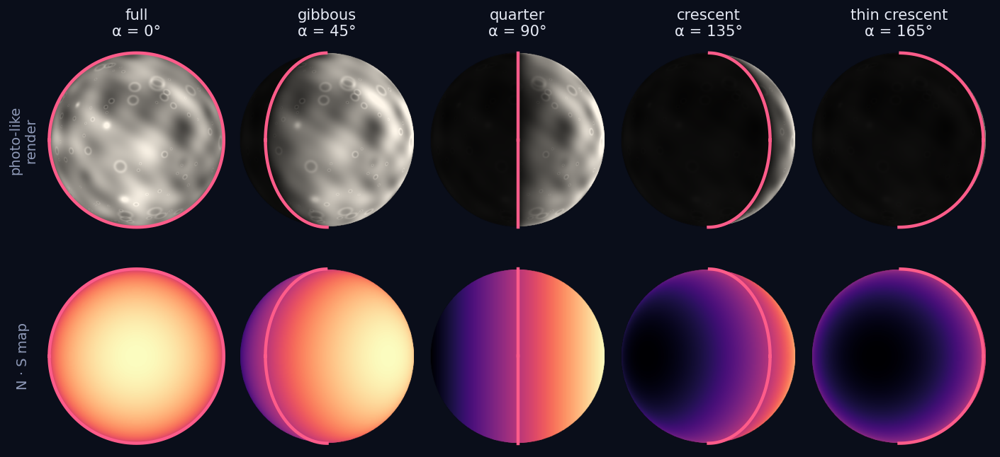

*Figure 10. Rendered Moon at five phase angles with the mathematical terminator (N · S = 0) drawn in pink. The bottom row shows the N · S map itself: bright = facing the Sun, dark = facing away.*

### Why the terminator appears curved in a 2-D image

The terminator is a circle on the 3-D sphere. A camera sees only the **projection** of that circle onto the image plane, and the projection of a circle viewed at an angle is an **ellipse** (the visible half of it is what we see). Since the circle is perpendicular to **S**, and the component of **S** along the line of sight is cos α, the ellipse has:

- semi-major axis = **R** (perpendicular to the Sun–observer plane)
- semi-minor axis = **R · |cos α|**

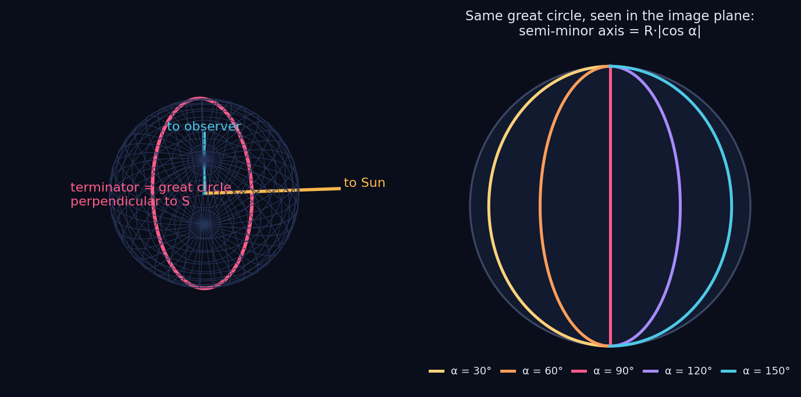

*Figure 11. The terminator is a great circle in 3-D. Seen from Earth, it becomes a half-ellipse whose width shrinks to zero at quarter phase (a straight line) and grows toward the limb near full or new Moon.*

> [!IMPORTANT]
> **3-D terminator → projection → 2-D curved boundary.** When you detect a curved terminator in an image, you are measuring the projection of a 3-D illumination boundary. The detection algorithm should be designed with the geometry in mind.

## 11. The subsolar point and the sub-Earth point

### The subsolar point

> [!NOTE]
> **Definition — Subsolar point.** The location on the Moon where the Sun is directly overhead (the point in the Sun direction). NASA's geometry documentation notes there are several precise definitions depending on the surface model; for a simplified spherical Moon the concept is straightforward.

It can be expressed in lunar coordinates, e.g. subsolar longitude = 116.296° and subsolar latitude = −2.4°. The values vary with time — which is exactly why the metadata is valuable. Instead of "this Moon image was taken at 14:00", we can say *"at this observation time, the Sun was located in this particular direction relative to the Moon"*.

### The sub-Earth point

> [!NOTE]
> **Definition — Sub-Earth point.** The location on the Moon where Earth is directly overhead. NASA's Moon Essentials material describes the longitude and latitude of this point as the quantities associated with lunar **libration**.

Both points are locations on the Moon that you can convert to vectors with Chapter 6's formulas:

```python
S = latlon_to_xyz(subsolar_lat,  subsolar_lon)
E = latlon_to_xyz(subearth_lat,  subearth_lon)
```

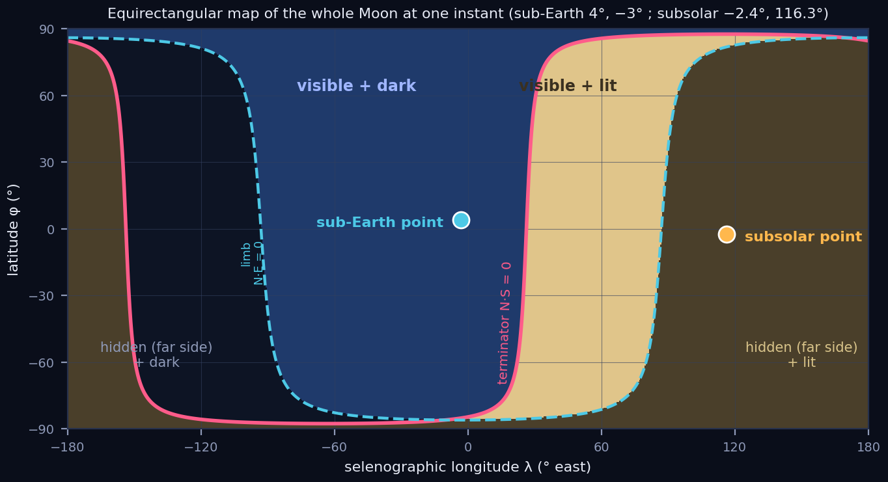

*Figure 12. One instant, whole Moon (equirectangular map). Cyan dashed = limb (edge of the Earth-facing hemisphere); pink = terminator. Colours show which of the four visibility/illumination combinations each surface point falls into.*

> [!WARNING]
> **Sub-Earth point ≠ pixel centre.** The sub-Earth point is a physical location on the lunar surface. The centre of the lunar disc is an image / projection concept. Under an idealised spherical geometry they are closely related, but real geometry involves lunar shape, orientation, projection, libration and the observer's position. They are strongly related — **not identical** — and the relationship is geometric, not a pixel assignment.

## 12. Phase angle

The angle between the directions toward the Sun and Earth, seen from the Moon, is related to the lunar phase. With Ŝ toward the Sun and Ê toward Earth:

$$\cos\alpha = \hat S\cdot\hat E \qquad k=\frac{1+\cos\alpha}{2}\ \text{(illuminated fraction of the visible disc)}$$

| α (Sun–Moon–Earth angle) | Ŝ · Ê | Illuminated fraction | Appearance |
|---|---|---|---|
| 0° | +1 | 100 % | full Moon |
| 45° | +0.71 | 85 % | gibbous |
| 90° | 0 | 50 % | quarter |
| 135° | −0.71 | 15 % | crescent |
| 180° | −1 | 0 % | new Moon |

> [!WARNING]
> **Document your convention.** The phase-angle convention depends on the definition used (some sources use *elongation*, the Sun–Earth–Moon angle seen from Earth, which is roughly 180° − α). The project's implementation should state explicitly which convention it uses. Conceptually: *Sun direction + Earth direction → illumination geometry → Moon phase.*

## 13. Visibility + illumination: the four categories

Not every lunar surface point is visible from Earth. For a simplified sphere, a point with normal **N** is visible if its normal points sufficiently toward the observer:

```text
N · E > 0  → visible from Earth
N · E = 0  → on the geometric limb
N · E < 0  → on the far side
```

That is exactly analogous to illumination. Combining the two tests gives four categories:

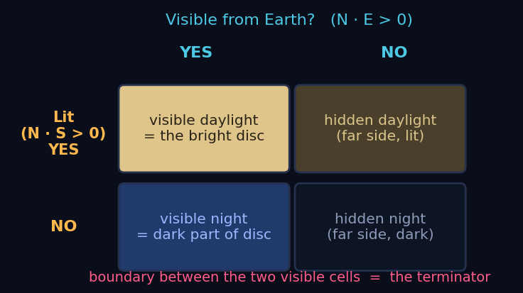

*Figure 13. Visible × lit. The visible + lit region is the bright part of the disc; visible + dark is the unlit part of the near hemisphere; the boundary between those two visible regions is the terminator.*

```python
import numpy as np

# P: array (..., 3) of unit normals; E, S: unit vectors toward Earth / Sun
visible = (P @ E) > 0
lit     = (P @ S) > 0
visible_and_lit  = visible &  lit     # bright disc
visible_and_dark = visible & ~lit     # night side of the near hemisphere
```

> [!NOTE]
> **The Earth is not infinitely far away.** Because the observer sits about 384,400 km from a Moon of radius 1,737 km, the exact visible cap is slightly smaller than a full hemisphere (its edge is at ≈ 89.74° from the sub-Earth point). For a beginner model, `N · E > 0` is an excellent approximation.

---

# Part IV — Libration, Orientation & Reference Frames

## 14. Libration: the wobbling Moon

The Moon is tidally locked: its rotation and orbital motion are synchronised so that approximately the same hemisphere faces Earth. But we do **not** see exactly the same 50 % all the time. NASA describes this apparent wobbling — caused by changes in viewing geometry — as **libration**. Over time we can see about **59 %** of the surface.

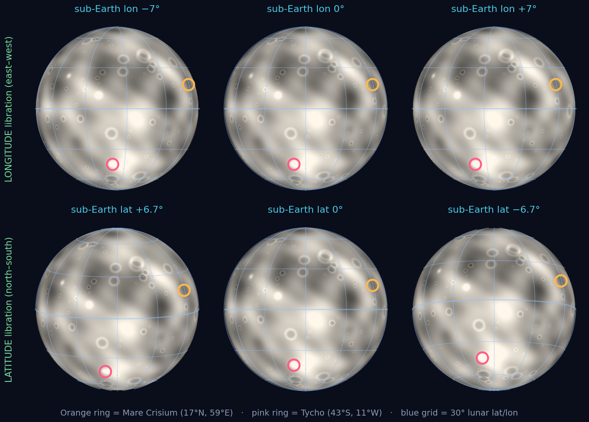

*Figure 14. The same lunar surface seen with different sub-Earth points. Orange ring = Mare Crisium (17°N, 59°E) · pink ring = Tycho (43°S, 11°W) · blue grid = 30° lunar lat/lon. Feature positions shift relative to the disc outline, and limb regions come into or go out of view. Shifts here match real-world extremes of about ±7°.*

### Libration in longitude (east–west)

An apparent side-to-side rotation that exposes small strips near the eastern and western lunar limbs. It arises mainly because the Moon rotates at a steady rate while its orbital speed changes (its orbit is elliptical). It can reach roughly **±8°**. The corresponding quantity is the **longitude of the sub-Earth point**.

### Libration in latitude (north–south)

An apparent up-down motion, primarily related to the tilt between the Moon's equator and its orbit, which lets observers see slightly more of the northern or southern regions. It reaches about **±6.7°**. The corresponding quantity is the **latitude of the sub-Earth point**.

> [!NOTE]
> **A smaller third effect.** Diurnal libration — the observer's changing viewpoint as Earth rotates — adds up to about 1°. For image-based work with catalogued metadata, the sub-Earth longitude and latitude already contain the net effect.

### Why libration matters to our project

Consider two observations. Image A has sub-Earth (lat +5°, lon −4°) and Image B has sub-Earth (lat −5°, lon +4°). They do not have exactly the same viewing geometry, so **the same lunar feature lands at a different pixel position**. If we simply stack the images we may create:

- blurred features;
- duplicated edges;
- incorrect terminator positions;
- false structures.

The astronomical geometry must be understood **before** sophisticated fusion.

## 15. Position angle, and rotation versus libration

Another important quantity in our dataset is the **position angle**. A simplified way to think about it: *how is the Moon's orientation rotated in the observed image?* Imagine an arrow for lunar north. Depending on the observation, that arrow may point straight up in the image or be tilted.

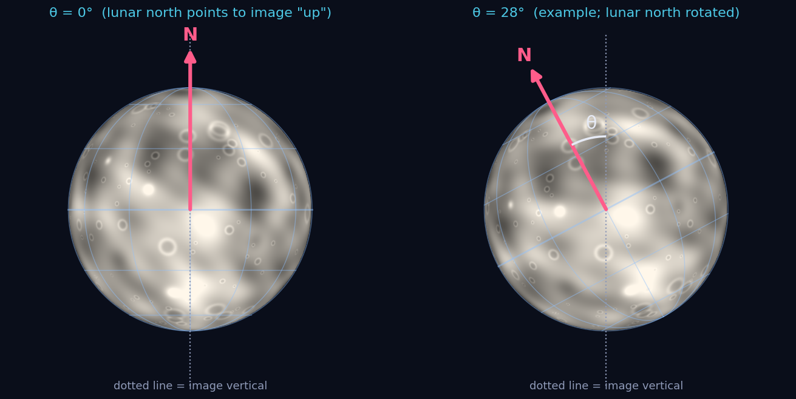

*Figure 15. Left: lunar north is aligned with image "up". Right: the same Moon whose orientation is rotated by θ. The image must be de-rotated before observations are compared.*

> [!WARNING]
> **Check the sign and reference of the angle.** Position angles are measured from a specified reference direction and increase in a specified sense (e.g. counter-clockwise). Whether to rotate the image by +θ or −θ to correct it depends on that definition **and** on the image coordinate handedness ([Chapter 17](#17-image-coordinates)). Verify with an image where a known feature should end up at the top.

### Rotation versus libration — do not confuse them

| | Rotation in the image | Libration |
|---|---|---|
| Question it answers | "Which way is lunar north pointing in my image?" | "Which part of the lunar surface is facing Earth?" |
| Quantity in metadata | position angle | sub-Earth latitude and longitude |
| Effect on the image | spins the whole disc about its centre | shifts features relative to the disc and changes which limb areas are visible |
| Fixed by | a 2-D rotation ([Ch. 19](#19-image-rotation)) | a 3-D re-projection ([Ch. 20](#20-putting-it-together-observation-geometry-and-the-three-transformations)) |

A contributor working on image alignment needs to understand both.

## 16. Reference frames and the Moon-fixed frame

For computational astronomy we often want a coordinate frame that rotates with the Moon: an invisible coordinate system attached to the Moon. This is a **body-fixed frame**, and it is fundamentally different from a frame fixed to Earth or to inertial space. SPICE documentation makes this distinction explicit: subsolar and sub-observer geometry can be expressed in a target body's time-dependent body-fixed frame.

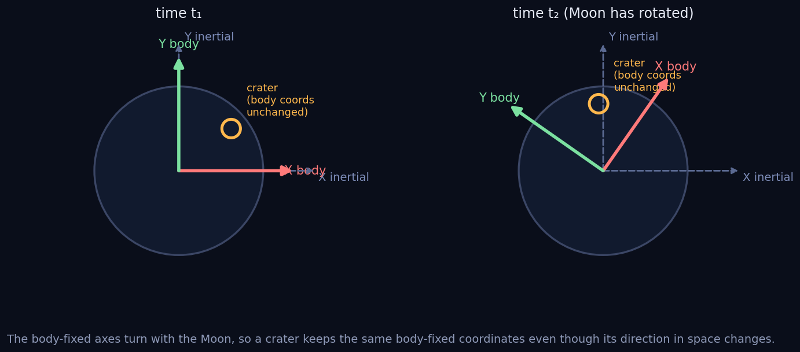

*Figure 16. A body-fixed frame rotates with the Moon. A crater has the same body-fixed coordinates at any time, but a different direction in the inertial frame.*

### Reference frame vs coordinate system

These terms are often used loosely, but they are different things. A **reference frame** describes the physical/geometric basis of the axes. A **coordinate system** describes how a location is represented *within* that frame.

| Reference frame | Coordinate representation | Example |
|---|---|---|
| Moon-fixed frame | latitude / longitude | (+12°, −35°) |
| Moon-fixed frame | x, y, z | (0.80, −0.57, 0.20) |
| Observer / view frame | x, y, z (z toward the viewer) | (0.1, 0.2, 0.97) |

The same physical point can therefore be represented in different mathematical forms. Cartesian axes are also a convention: do not assume which axis is east, north or up unless the frame definition says so.

### The coordinate hierarchy

| Level | Coordinate concept | Purpose |
|---|---|---|
| 1 | Lunar latitude / longitude | Locate a surface point |
| 2 | Lunar Cartesian (x, y, z) | Perform 3-D geometry |
| 3 | Moon-fixed reference frame | Keep coordinates attached to the Moon |
| 4 | Observer / view frame | Describe the viewing direction |
| 5 | Image coordinates (u, v) | Locate pixels |
| 6 | Normalised image coordinates | Compare differently scaled images |

> [!IMPORTANT]
> **You do not need everything at once.** You do not need to master every astronomical reference frame before contributing. The six levels above are enough for a beginner.

---

# Part V — From the Sky to Pixels

## 17. Image coordinates

A digital image usually places the origin at the **top-left** pixel, with **x** (column) increasing to the right and **y** (row) increasing **downward**. That is different from the mathematical Cartesian plane, in which y increases upward.

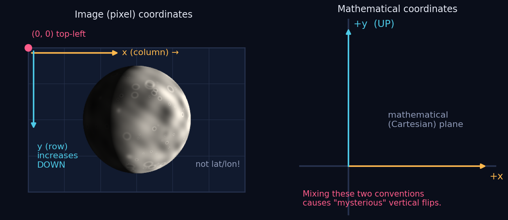

*Figure 17. Image coordinates (left) versus mathematical coordinates (right). The vertical direction is flipped.*

> [!WARNING]
> **Source of many bugs.** The flipped y axis causes apparent vertical flips, and it also reverses what "positive rotation" looks like on screen ([Chapter 19](#19-image-rotation)). Whenever you write a coordinate, ask: **which convention is this?**

### Pixel coordinates are not lunar coordinates

Suppose we detect a feature at `pixel = (960, 540)`. That does not mean longitude = 0° and latitude = 0°. It only means column = 960, row = 540. To interpret it astronomically we need the **projection and orientation** — the metadata.

## 18. The Moon disc and normalised coordinates

### The Moon disc

Our first practical simplification is to identify the lunar disc. Suppose the image has centre (cx, cy) and radius R<sub>px</sub>. An ideal spherical Moon is approximated by:

$$(x-c_x)^2+(y-c_y)^2\le R_{px}^2$$

```python
import numpy as np

Y, X = np.indices(image.shape[:2])
mask = ((X - cx)**2 + (Y - cy)**2) <= radius**2      # True inside the Moon
```

### Normalised image coordinates

For geometry, raw pixels are inconvenient. Normalise them:

$$x_n=\frac{x-c_x}{R_{px}} \qquad y_n=\frac{y-c_y}{R_{px}}$$

Now the Moon centre is at (0, 0) and the Moon edge is approximately at radius 1: the Moon becomes a **unit disc**. This is extremely useful for comparing images with different resolutions.

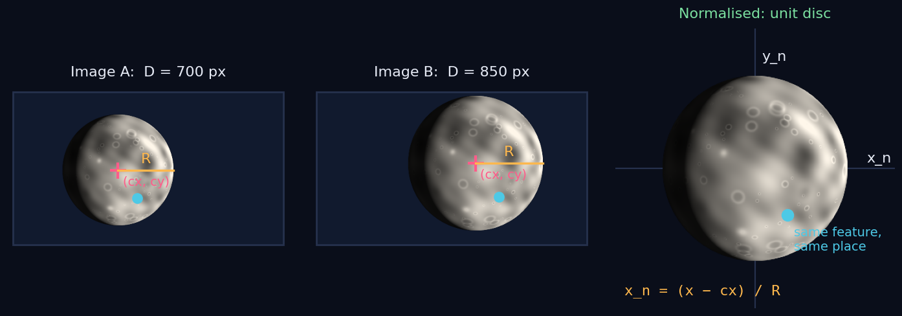

*Figure 18. Two images of the same Moon with different apparent diameters (700 px and 850 px). A feature sits at different pixel distances from the centre, but at the **same** place on the unit disc after normalisation.*

> [!IMPORTANT]
> **Why diameter normalisation matters.** If Image A has a Moon diameter of 700 px and Image B has 850 px, the same feature lies at different pixel distances from the centre. After normalisation both images live in a **common coordinate space**. That is why the project's diameter-normalisation step is so important.

> [!TIP]
> **Try it.** Given `cx`, `cy` and `radius`, compute `x_n` and `y_n` for every pixel and visualise the result: the region where `x_n² + y_n² ≤ 1` should be a perfect unit disc.

## 19. Image rotation

Suppose the Moon must be rotated by angle θ. A 2-D point is rotated by:

$$\begin{pmatrix}x'\\y'\end{pmatrix}=\begin{pmatrix}\cos\theta&-\sin\theta\\ \sin\theta&\cos\theta\end{pmatrix}\begin{pmatrix}x\\y\end{pmatrix}$$

### Rotate about the right centre

We generally want to rotate relative to the Moon centre (cx, cy). First subtract it, then rotate, then add it back:

```text
x_c = x - cx ,  y_c = y - cy
x_r = x_c·cosθ − y_c·sinθ ,  y_r = x_c·sinθ + y_c·cosθ
x'  = x_r + cx ,  y' = y_r + cy
```

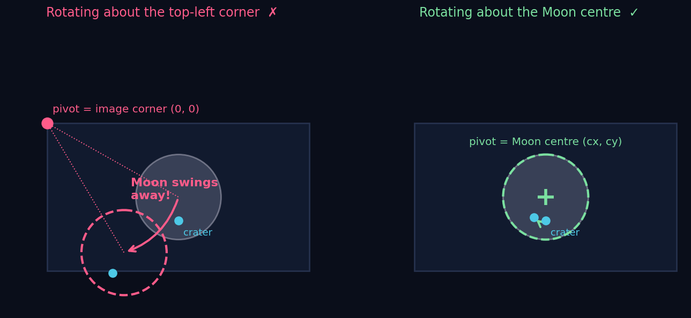

*Figure 19. Left: pivoting about the image corner flings the Moon across the frame ✗. Right: pivoting about the Moon centre spins the disc in place ✓.*

```python
import cv2

# OpenCV: positive angle = counter-clockwise on screen, origin = top-left
M = cv2.getRotationMatrix2D((cx, cy), angle_deg, 1.0)     # centre, angle, scale
rotated = cv2.warpAffine(image, M, (width, height))
```

> [!WARNING]
> **Sign conventions.** The raw matrix above assumes y increases **upward**. In an image where y increases **downward**, the same formula produces a rotation that looks **clockwise** on screen. OpenCV's `getRotationMatrix2D` already accounts for this (positive angle = counter-clockwise on screen). Test your rotation direction on a synthetic image with an obvious marker.

## 20. Putting it together: observation geometry and the three transformations

For one observation we have a single moment in time, from which the geometry unfolds:

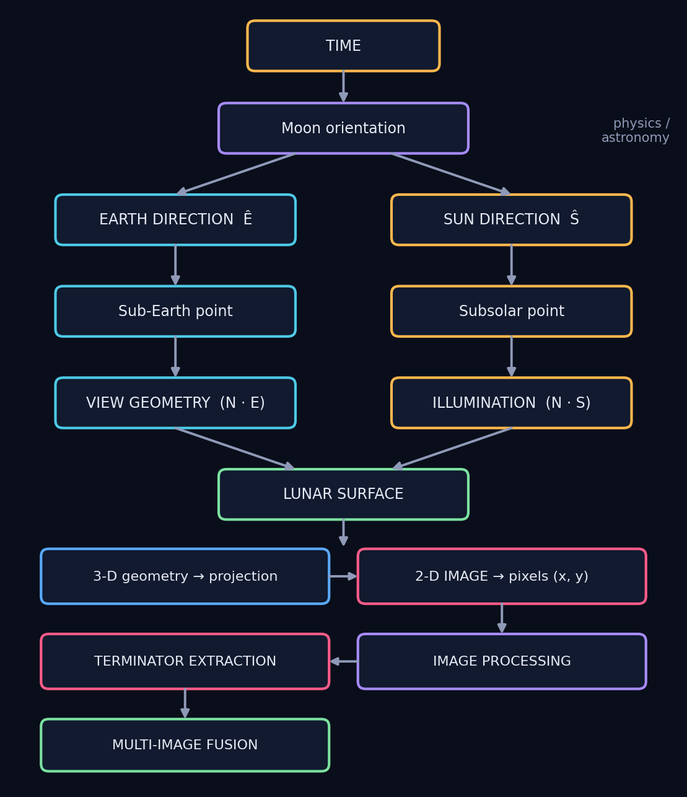

*Figure 20. Time determines the Moon's orientation, the Earth and Sun directions, the sub-Earth and subsolar points, the view and illumination geometry, the projected image, and finally the algorithms the pipeline runs.*

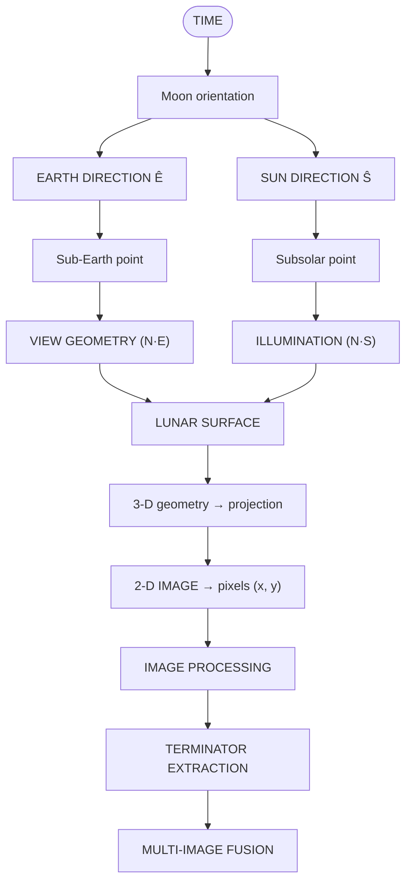
```mermaid
flowchart TD
    T([TIME]) --> O["Moon orientation"]
    O --> E["EARTH DIRECTION Ê"]
    O --> S["SUN DIRECTION Ŝ"]
    E --> SE["Sub-Earth point"] --> V["VIEW GEOMETRY (N·E)"]
    S --> SS["Subsolar point"] --> I["ILLUMINATION (N·S)"]
    V --> L["LUNAR SURFACE"]
    I --> L
    L --> P["3-D geometry → projection"]
    P --> IMG["2-D IMAGE → pixels (x, y)"]
    IMG --> IP["IMAGE PROCESSING"]
    IP --> TE["TERMINATOR EXTRACTION"]
    TE --> F["MULTI-IMAGE FUSION"]
```

### The three most important transformations

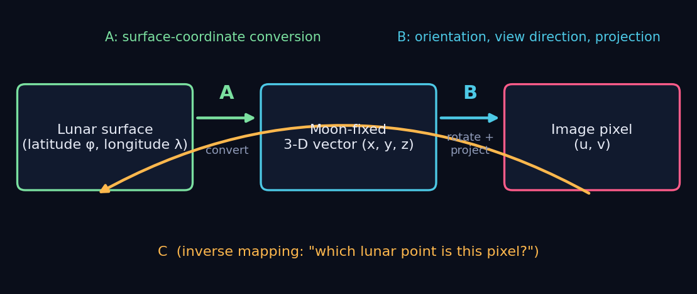

*Figure 21. **A**: latitude/longitude ↔ 3-D vector. **B**: Moon-fixed vector → observer/image coordinates (orientation, view direction, rotation, projection). **C**: the inverse mapping from image pixels back to lunar coordinates.*

| Transformation | From → to | Involves |
|---|---|---|
| A | latitude/longitude → 3-D lunar coordinates | a surface-coordinate conversion ([Ch. 6](#6-from-spherical-coordinates-to-cartesian-vectors-and-back)) |
| B | Moon-fixed coordinates → observer / image coordinates | lunar orientation, viewing direction, rotation, projection |
| C | image coordinates → lunar coordinates | the inverse mapping; needed to say "this pixel is this lunar location" |

### Four questions you should never mix up

| Concept | The question it answers |
|---|---|
| Position | Where is the Moon relative to Earth / Sun / other bodies? |
| Orientation | How is the Moon's body-fixed coordinate system oriented? |
| Surface location | Where is a particular crater or terrain point **on the Moon**? |
| Image location | Where does that terrain point **appear in the image**? |

### Two observations, different geometry

Suppose Observation A has sub-Earth (lat +4°, lon −3°) and subsolar (lat +2°, lon 70°), while Observation B has sub-Earth (lat −4°, lon +3°) and subsolar (lat −1°, lon 100°). The Moon is observed under different geometry, which changes:

- the visible surface;
- the illumination;
- the terminator position;
- the apparent positions of features;
- the orientation.

This is precisely why multiple observations contain **complementary** information.

### Why the project metadata matters

A contributor might think: *"we already have the image — why do we need the JSON?"* Because the image alone does not necessarily tell us all of the physical geometry. The metadata provides:

| Metadata field | Tells us about |
|---|---|
| time | when the observation applies (and therefore the geometry) |
| subsolar position | the Sun direction → illumination geometry |
| sub-Earth position | the Earth direction → viewing geometry / libration |
| position angle | how the Moon is rotated in the image |

> [!IMPORTANT]
> **IMAGE + METADATA = OBSERVATION.** Keep this model in mind whenever a function receives one but not the other.

---

# Part VI — Real Terrain and the Terminator

## 21. The real Moon is not an ideal sphere

A real image is not an ideal sphere. There are several complications:

- craters, mountains, valleys and local slopes;
- shadows;
- atmospheric / telescope effects;
- image noise and rendering effects;
- surface reflectance (some terrain is intrinsically brighter).

> [!IMPORTANT]
> **Terrain is the scientific motivation.** `terrain → surface normals → illumination differences → brightness / shadows → information near the terminator`. If the Moon were perfectly smooth, the terminator would carry no terrain information at all.

### Global terminator vs local shadow boundary

| | Global terminator | Local shadow boundary |
|---|---|---|
| What it is | Large-scale day/night boundary set primarily by the Sun–Moon geometry | A boundary produced by terrain blocking sunlight |
| Where | Where N · S = 0 for the smooth surface | Anywhere terrain casts a shadow; may be far from the global line |
| Use | Alignment and geometry checks | Terrain information |

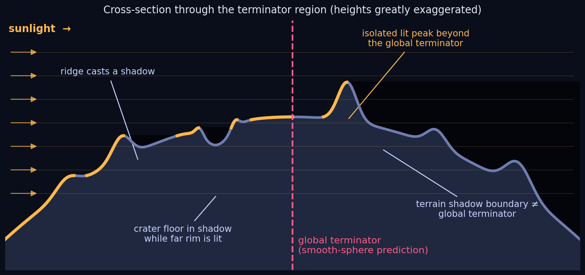

*Figure 22. On the lit side, a ridge shadows the ground behind it and a crater floor can be dark while its rim is lit. Beyond the global terminator, a tall peak can still catch sunlight.*

> [!WARNING]
> **Not every brightness edge is the terminator.** An image-processing algorithm must not interpret every bright/dark transition as the global terminator. It must distinguish large-scale illumination geometry from local terrain effects.

## 22. Why we use a gradient band

An ideal mathematical terminator is a curve. A real image contains noise, terrain shadows, reflectance variation, sampling and blur. Detecting exactly one pixel can therefore be unstable. Instead we represent the transition as a **band** — a region of gradual change from dark to bright — rather than pretending the boundary is infinitely sharp.

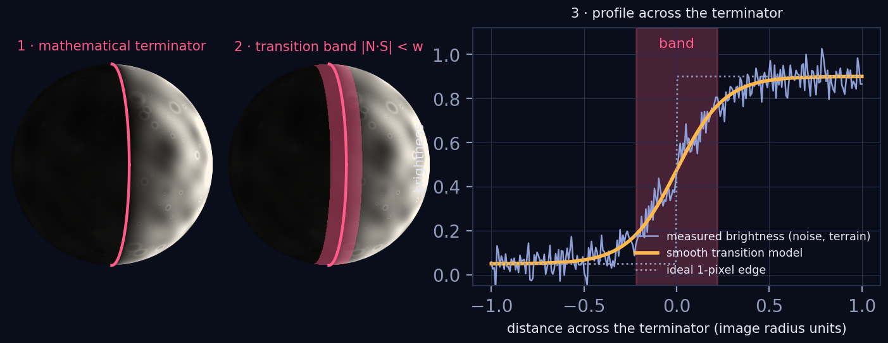

*Figure 23. Left: the exact terminator N · S = 0. Middle: a band of pixels where |N · S| < w. Right: a measured brightness profile is noisy; a smooth transition model and its band are far more stable than an ideal one-pixel edge.*

> [!IMPORTANT]
> **A band is honest about uncertainty.** The width of the band controls how much of the terminator neighbourhood is treated as "transition". It is a design parameter — choose it from the blur, noise and resolution of your data.

## 23. Connecting the science to the pipeline

| Step | Pipeline stage | Astronomical concept behind it |
|---|---|---|
| 1 | Read NASA metadata: time, sub-Earth, subsolar, position angle | observation geometry |
| 2 | Detect the Moon: (cx, cy, D) | the projected lunar disc |
| 3 | Normalise image → standard Moon size | common coordinate space ([Ch. 18](#18-the-moon-disc-and-normalised-coordinates)) |
| 4 | Correct orientation: position angle → image rotation | orientation vs libration ([Ch. 15](#15-position-angle-and-rotation-versus-libration), [19](#19-image-rotation)) |
| 5 | Interpret sub-Earth → viewing geometry; subsolar → illumination | [Ch. 11](#11-the-subsolar-point-and-the-sub-earth-point), [13](#13-visibility--illumination-the-four-categories) |
| 6 | Detect the brightness transition | terminator + terrain ([Ch. 10](#10-the-terminator), [21](#21-the-real-moon-is-not-an-ideal-sphere)) |
| 7 | Represent the terminator as a smooth band | uncertainty & noise ([Ch. 22](#22-why-we-use-a-gradient-band)) |
| 8 | Compare with another observation | libration ⇒ different geometry ([Ch. 14](#14-libration-the-wobbling-moon)) |
| 9 | Fuse surface information across observations | complementary illumination |


```mermaid
flowchart LR
    M["1 · Read metadata"] --> D["2 · Detect Moon<br/>(cx, cy, D)"]
    D --> N["3 · Normalise<br/>to unit disc"]
    N --> R["4 · Rotate by<br/>position angle"]
    R --> G["5 · Interpret<br/>Ŝ and Ê"]
    G --> B["6 · Detect brightness<br/>transition"]
    B --> BAND["7 · Smooth band<br/>representation"]
    BAND --> C["8 · Compare<br/>observations"]
    C --> F["9 · Fuse"]
```

**A worked setup:** a 1920 × 1080 image, Moon centre (cx, cy), diameter D pixels, position angle θ, sub-Earth (lat<sub>e</sub>, lon<sub>e</sub>) and subsolar (lat<sub>s</sub>, lon<sub>s</sub>). The astronomy is not separate from the software: it determines what the software is actually calculating.

---

# Part VII — Advanced: Where SPICE Fits

## 24. NASA/JPL SPICE

For advanced contributors, NASA/JPL's **SPICE** system is worth learning. SPICE is a toolkit and data system for calculating spacecraft and planetary observation geometry. Its tutorials cover coordinate frames, time systems, planetary positions and orientations, reference frames, and observation geometry. For Terminator Moon, SPICE becomes interesting if we want to independently reproduce or verify:

- the Sun → Moon direction;
- the Earth → Moon direction;
- the subsolar point;
- the sub-Earth point;
- the Moon's orientation.

### Why SPICE is an advanced topic

A beginner should **not** start by installing SPICE and trying to understand hundreds of kernels — that creates unnecessary complexity. First learn the fundamentals; then learn SPICE:

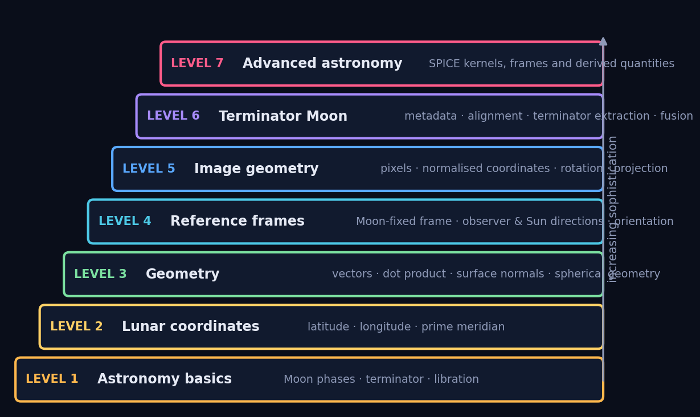

*Figure 24. The recommended progression: master each level before the next. SPICE is the final, advanced level.*

### Body-fixed frames in SPICE

SPICE distinguishes between reference frames. A Moon-fixed frame rotates with the Moon, so a lunar feature keeps approximately fixed coordinates in that frame even though the Moon's orientation relative to an external observer changes. Commonly used Moon-fixed frames in SPICE include the mean-Earth/polar-axis frame, `MOON_ME`, and the principal-axis frame, `MOON_PA`; check the project's data specification for which one applies.

### Subsolar and sub-Earth points: a more precise view

"The point directly underneath the Sun" is only an introductory definition. NASA/JPL's SPICE documentation notes that different mathematical definitions can be used depending on whether the body is modelled as a sphere, an ellipsoid, or a detailed topographic surface. For example, SPICE can compute a subsolar point using a *nearest-point* or an *intercept* definition.

| Surface model | Complexity | Notes |
|---|---|---|
| Perfect sphere | simple geometry | Excellent teaching model; used throughout this guide |
| Ellipsoid | more accurate geometry | The near-point and intercept definitions of a sub-point start to differ |
| Topographic model | terrain-aware geometry | Highest fidelity; needed for precision surface reconstruction |

> [!WARNING]
> **Document the approximation.** For the early Terminator Moon pipeline, clearly document which approximation is being used for subsolar / sub-Earth points, phase angle and visibility.

JPL's WebGeocalc examples demonstrate computing the Moon's sub-Earth point in a Moon body-fixed frame and returning its planetocentric longitude and latitude — a useful reference when moving from the conceptual model toward precise calculations.

### Where to start reading

| NAIF SPICE tutorial | Why it matters here |
|---|---|
| 04 · Concepts | the SPICE mental model: kernels, ephemerides, frames |
| 05 · Conventions | units, angle and sign conventions |
| 15 · Time | time systems: UTC, TDB, why they differ |
| 17 · Frames and Coordinate Systems | the core of this guide, done rigorously |
| 23 · Lunar–Earth PCK/FK | Moon orientation kernels and frames |
| 27 · Derived Quantities | sub-observer / subsolar points and related geometry |

Do not try to read all of the SPICE documentation at once; use it as the project becomes more mathematically sophisticated.

---

# Part VIII — Practice & Reference

## 25. Self-check: what a new contributor should be able to explain

Ten questions to test your understanding before touching geometry code. Cover the right column and try first!

| Question | Answer |
|---|---|
| 1. What is latitude? | Angular position north/south of a reference equator. |
| 2. What is longitude? | Angular position around the body relative to a reference meridian. |
| 3. What is the sub-Earth point? | The lunar surface location associated with the direction toward Earth. |
| 4. What is the subsolar point? | The lunar surface location associated with the direction toward the Sun. |
| 5. What is libration? | The apparent variation in the portion / orientation of the Moon seen from Earth. |
| 6. What is a surface normal? | A vector perpendicular to the local surface. |
| 7. Why does N · S matter? | It measures how directly a surface is oriented toward the Sun and therefore relates to illumination. |
| 8. (lat, lon) vs (x, y)? | The first describes a physical lunar surface location; the second describes a location in an image. |
| 9. Why can't we directly stack two Moon images? | Their scale, orientation, viewing geometry and illumination can differ. |
| 10. Why do we need metadata? | Because the image alone does not completely specify the astronomical observation geometry. |

> [!IMPORTANT]
> **The habit to build.** Ask, for every number: *"What physical point or direction does this number actually represent?"*

## 26. Common beginner mistakes

The seven mistakes that most often produce plausible-looking but wrong results.

| # | Mistake | What to do instead |
|---|---|---|
| 1 | Treating latitude as Y (and longitude as X) | It is tempting to write latitude → y, longitude → x. This is not generally valid for an image: there is a projection between the spherical surface and the image plane. |
| 2 | Forgetting radians | `np.sin(30)` does not compute sin 30°. Use `np.sin(np.radians(30))`. |
| 3 | Confusing longitude direction | Datasets and software differ. Always verify range, sign, direction and prime meridian before implementing transformations. |
| 4 | Confusing image Y with mathematical Y | Image coordinates increase downward; mathematical coordinates increase upward. This introduces apparent vertical flips. |
| 5 | Assuming the Moon is perfectly spherical | A sphere is an excellent teaching model, but not necessarily sufficient for high-precision scientific reconstruction. Know which model each algorithm assumes. |
| 6 | Assuming the sub-Earth point is simply the pixel centre | The relationship is geometric, not merely a pixel assignment. |
| 7 | Treating every dark/bright boundary as the terminator | Terrain creates local shadows. The algorithm must distinguish large-scale illumination geometry from local terrain effects. |

## 27. Suggested learning exercises

Implement a few tiny exercises. Starter solutions follow; the first two are already in [Chapter 6](#6-from-spherical-coordinates-to-cartesian-vectors-and-back).

### Exercises 1 & 2 — spherical ↔ Cartesian

Write `latlon_to_xyz(lat, lon, radius)` and `xyz_to_latlon(x, y, z)`, and verify that `(lat, lon) → xyz → (lat, lon)` returns the original coordinates.

### Exercise 3 — dot product

```python
import numpy as np

N = unit(latlon_to_xyz(0, 0))          # surface normal at the sub-Earth point
for a in (0, 45, 90, 135, 180):
    S = unit(latlon_to_xyz(0, a))      # Sun at longitude a
    print(a, round(float(N @ S), 3))   # 1.0, 0.707, 0.0, -0.707, -1.0  (= cos a)
```

### Exercise 4 — generate a synthetic terminator

```python
import numpy as np, matplotlib.pyplot as plt

lat, lon = np.meshgrid(np.linspace(-90, 90, 361), np.linspace(-180, 180, 721), indexing='ij')
la, lo = np.radians(lat), np.radians(lon)
P = np.stack([np.cos(la)*np.cos(lo), np.cos(la)*np.sin(lo), np.sin(la)], axis=-1)

S = unit(latlon_to_xyz(-2.4, 116.3))   # example subsolar point from Chapter 11
illum = P @ S

plt.imshow(illum, extent=[-180, 180, -90, 90], origin='lower', cmap='magma')
plt.contour(lon, lat, illum, levels=[0], colors='cyan')   # N . S = 0 -> terminator
plt.xlabel('longitude'); plt.ylabel('latitude'); plt.show()
```

### Exercise 5 — image-coordinate normalisation

```python
h, w = image.shape[:2]
Y, X = np.indices((h, w))
xn = (X - cx) / radius
yn = (Y - cy) / radius
inside = xn**2 + yn**2 <= 1     # visualise `inside` - it must be a unit disc
```

### Exercise 6 — rotation

Take a Moon image and rotate it about its centre by 0°, 5°, 10°, −5°, −10° ([Chapter 19](#19-image-rotation)). Observe how the position of lunar features changes, and confirm that the disc centre does not move.

> [!TIP]
> **Stretch goal.** Render a shaded sphere yourself: for every pixel inside the unit disc compute `(x_n, y_n, z_n = √(1 − x_n² − y_n²))` as the normal, dot it with a Sun vector, and display `max(N · S, 0)`. Vary the Sun longitude and watch the phases of [Figure 10](#10-the-terminator) appear.

## 28. Recommended study order and resources


*Figure 25. Do not study everything simultaneously. Work through the levels in order (same ladder as Figure 24).*

### Essential

| Resource | Use it for |
|---|---|
| **NASA — Moon Phase and Libration** (NASA Scientific Visualization Studio). The *first* resource new members should look at; it gives a visual understanding of changing lunar appearance, libration, the orbit, and the subsolar / sub-Earth points, in Northern and Southern Hemisphere views. | Moon phases · libration · sub-Earth point · subsolar point · changing viewing geometry |
| **NASA SVS — Moon Essentials: Libration in Longitude** | longitude libration · eastern / western limb visibility · sub-Earth longitude |
| **NASA SVS — Moon Essentials: Libration in Latitude** | latitude libration · lunar orbital inclination · north / south visibility |

### Intermediate

| Resource | Use it for |
|---|---|
| **NASA/JPL NAIF — SPICE Tutorials.** Dedicated tutorials on concepts, conventions, time systems, reference frames, coordinate systems, planetary orientation, lunar/Earth kernels and observation geometry (see the list in [Chapter 24](#24-nasajpl-spice)). | concepts · frames · time · derived quantities |
| **NASA/JPL — Subsolar Point documentation** (NAIF). For when you want the difference between the simple subsolar-point definition and ellipsoid/topographic calculations. | precision definitions |

> [!NOTE]
> **Finding them.** Search the titles above on [svs.gsfc.nasa.gov](https://svs.gsfc.nasa.gov) (NASA Scientific Visualization Studio) and [naif.jpl.nasa.gov](https://naif.jpl.nasa.gov) (SPICE); JPL's WebGeocalc web tool is a good place to try geometry calculations without installing anything. Page addresses change over time, so use the titles rather than saved links.

## 29. The final mental model


*Figure 26. The diagram to remember (same as Figure 2): **S** → illumination geometry; **E** → viewing geometry; **S** + lunar surface → terminator; **E** + lunar surface → visible hemisphere; then Moon-fixed coordinates → 3-D geometry → viewing geometry → image projection → pixel (x, y).*

> [!IMPORTANT]
> **The entire scientific foundation in one sentence.** Time fixes the Moon's orientation and the directions to Earth and the Sun; those give the view and the illumination on the lunar surface; 3-D geometry is projected into a 2-D image whose pixels the software processes to extract and fuse the terminator.

A contributor does not need to become an astronomer before contributing. However, anyone working on the geometry, alignment, terminator extraction or fusion algorithms should understand this chain well enough to answer:

> [!IMPORTANT]
> **The question to make a habit.** *"What physical point or direction does this number actually represent?"*

---

# Appendices

## A Glossary

| Term | Meaning |
|---|---|
| **Albedo** | How reflective a surface is (fraction of light reflected). |
| **Body-fixed frame** | A coordinate frame that rotates with a body (here: the Moon). |
| **Cartesian coordinates** | Position described by perpendicular-axis components (x, y, z). |
| **Dot product** | a · b = \|a\|\|b\| cos θ; for unit vectors it is the cosine of the angle between them. |
| **Ê** | Unit vector from the Moon toward Earth (the observer). |
| **Great circle** | A circle on a sphere whose centre is the sphere's centre; the terminator is one. |
| **Haversine** | A numerically stable formula for angular distance on a sphere. |
| **Libration** | Apparent wobble of the Moon that changes which parts of it we see. |
| **Limb** | The edge of the visible disc. |
| **Position angle** | Orientation of lunar north in the image relative to a reference direction. |
| **Phase angle (α)** | Sun–Moon–Earth angle at the Moon; cos α = Ŝ · Ê. |
| **Prime meridian** | The lunar meridian at longitude 0°. |
| **Selenographic** | Relating to mapping the Moon (Moon's latitude/longitude system). |
| **Ŝ** | Unit vector from the Moon toward the Sun. |
| **SPICE** | NASA/JPL NAIF toolkit and data system for observation geometry. |
| **Sub-Earth point** | Lunar surface point with Earth overhead; its lat/lon quantify libration. |
| **Subsolar point** | Lunar surface point with the Sun overhead. |
| **Surface normal** | Unit vector perpendicular to the local surface. |
| **Terminator** | Boundary between lit and unlit terrain (N · S = 0 on a smooth sphere). |
| **Tidal locking** | Rotation synchronised with orbit, so one hemisphere mostly faces Earth. |

## B Formula cheat sheet

| Purpose | Formula |
|---|---|
| Degrees → radians | $\text{rad} = \text{deg}\cdot\pi/180$ |
| Spherical → Cartesian | $x=R\cos\varphi\cos\lambda,\; y=R\cos\varphi\sin\lambda,\; z=R\sin\varphi$ |
| Cartesian → spherical | $r=\sqrt{x^2+y^2+z^2},\; \varphi=\arcsin(z/r),\; \lambda=\operatorname{atan2}(y,x)$ |
| Angle between unit vectors | $\cos\theta = a\cdot b$ |
| Lit / terminator / dark | $N\cdot S>0$ ; $N\cdot S=0$ ; $N\cdot S<0$ |
| Visible / limb / far side | $N\cdot E>0$ ; $N\cdot E=0$ ; $N\cdot E<0$ |
| Phase angle; lit fraction | $\cos\alpha=\hat S\cdot\hat E$ ; $k=(1+\cos\alpha)/2$ |
| Terminator ellipse (image) | semi-major $=R$ ; semi-minor $=R\,\lvert\cos\alpha\rvert$ |
| Haversine | $a=\sin^2(\Delta\varphi/2)+\cos\varphi_1\cos\varphi_2\sin^2(\Delta\lambda/2)$ ; $c=2\,\operatorname{atan2}(\sqrt a,\sqrt{1-a})$ ; $d=Rc$ |
| Disc mask | $(x-c_x)^2+(y-c_y)^2\le R_{px}^2$ |
| Normalised image coords | $x_n=(x-c_x)/R_{px}$ ; $y_n=(y-c_y)/R_{px}$ |
| 2-D rotation about $(c_x,c_y)$ | $x'=c_x+(x-c_x)\cos\theta-(y-c_y)\sin\theta$ ; $y'=c_y+(x-c_x)\sin\theta+(y-c_y)\cos\theta$ |

## C Key numbers

| Quantity | Approximate value |
|---|---|
| Mean lunar radius | 1,737.4 km |
| Mean Earth–Moon distance | 384,400 km |
| Length of 1° on the lunar equator | ≈ 30.3 km |
| Fraction of the surface visible from Earth over time | ≈ 59 % |
| Maximum libration in longitude | ≈ ±8° |
| Maximum libration in latitude | ≈ ±6.7° |
| Synodic month (new Moon to new Moon) | ≈ 29.53 days |

*These are rounded reference values for orientation; use authoritative sources or SPICE kernels when precision matters.*
